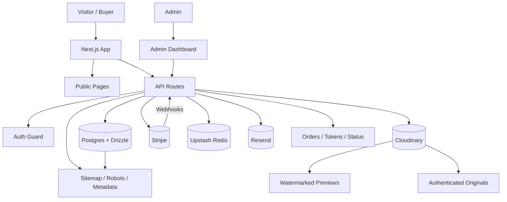

# Photographer Portfolio & Storefront

A modern photographer portfolio and storefront built with Next.js. The site combines public image browsing, secure photo sales, service pages, and admin content management in one application.

## Architecture

**Architecture style:** **Modular monolith**

This project uses a single Next.js codebase. Public pages, admin tools, API routes, payment processing, and database access are separated by feature, but they are not deployed as independent services. That makes this system a **modular monolith**, not a microservice architecture.

## Architecture Diagram

## What the site does

* Displays a public gallery with photo permalinks
* Opens a fast lightbox for browsing images
* Supports secure photo purchases through Stripe
* Sends confirmation and refund emails through webhooks
* Keeps originals private while serving watermarked previews
* Provides admin tools for assets, services, and content
* Generates SEO metadata, sitemap, and robots files

## Core flows

### Upload

Files are verified by actual bytes, not by the browser-reported MIME type.
Each asset stores a watermarked preview and a private original separately.

### Checkout

The client sends only an `assetId`.
The server reads the final price from the database and creates the Stripe checkout session.

### Payment confirmation

Payment is confirmed only through Stripe webhooks, not through the success redirect.

### Download

After payment, the webhook issues a short-lived token.
Downloads are rate-limited and checked again against the database before access is granted.

### Refunds and expiry

Refunds invalidate access immediately, and abandoned checkouts expire automatically.

## Key decisions

* Public preview and private original are separate Cloudinary uploads
* Watermarking happens server-side
* Webhook handling is idempotent
* Access tokens are short-lived and revalidated at download time
* Admin routes are protected both at the edge and inside API routes
* Public pages are rendered dynamically
* Drizzle is used instead of Prisma for a lighter serverless footprint

## Known gaps

* Automated tests are not yet in place
* CI/CD workflows still need to be added
* The admin sidebar is not fully mobile responsive

## Summary

This project is best described as a **modular monolith**: one Next.js application with clearly separated features and external integrations, rather than multiple independently deployed microservices.
